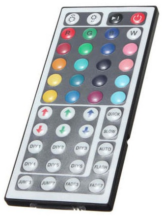

NecIR
=====

Arduino library to receive and decode codes sent by infrared remote controls using the NEC protocol.
Documentation on th eprotocl can be found here: http://techdocs.altium.com/display/ADRR/NEC+Infrared+Transmission+Protocol

This protocol is used by many consumer electronics devices produced in Japan.
It is also used by the typical IR remote controls and LED controlers that are shipped with cheap RGB LED strips from China:

